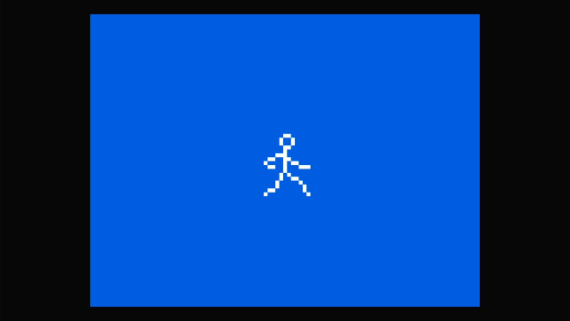

# RPI RunningManBareMetal



This is a "bare-metal" program for the raspberry pi
that has an animation of a stick figure man running across 
the screen.

Bare-metal means that there is no Operating System (such as Linux) that
is running on the raspberry pi. The program is interfacing with the hardware
directly using the documented register interfaces. For example for the RPI4
the [bcm2711-peripherals.pdf](https://datasheets.raspberrypi.org/bcm2711/bcm2711-peripherals.pdf) was used.  
Most RPI datasheets are available from

https://datasheets.raspberrypi.org/

The code in this repository is a modified version  of the 
[code found in part15](https://github.com/rockytriton/LLD/tree/main/rpi_bm/part15) of the 
[Low Level Devel - Paspberry Pi Bare Metal](https://www.youtube.com/playlist?list=PLVxiWMqQvhg9FCteL7I0aohj1_YiUx1x8)
Youtube series.

The above Youtube series references Sergey Matyukevich's tutorial
which teaches how to create a simple operating system (OS) kernel from
scratch.

[https://github.com/s-matyukevich/raspberry-pi-os](https://github.com/s-matyukevich/raspberry-pi-os)

## Video

https://user-images.githubusercontent.com/410908/134825823-d8d1f77c-85e5-4906-a943-00db8fcaa600.mp4

## Code

This code uses the [mailbox api](https://github.com/raspberrypi/firmware/wiki) 
to communicate with the RPI GPU to request
a framebuffer that is 800x600 resolution with 8bits per pixel.  

The heart of this demo is the *video_update()* function in the file *video.c*.
This function sets up a DMA transfer in 2D mode to copy bitmaps from the
bitmapbuffer to the active framebuffer.  

```c
void video_update()
{
    static u32 index = 0;
    static u32 xpos = 0;
    // vert center. ypos = half_screen_height - half_man_height
    const u32 ypos = (fb_req.res.yres/2) -  (man_get_height()*SCALE/2);

    u32 man_anim[4] = {0, 1, 2, 1};
    u32 curr_frame = man_anim[index];
    u32 blank_frame = 3;

    // Calculate TXFR_LEN : DMA Transfer Length.
    // YLENGTH = upper 16 bits. Rows per frame
    // XLENGTH = lower 16 bits.  Bytes per row.
    u32 xlength = man_get_width()*SCALE;
    u32 ylength = man_get_height()*SCALE;
    u32 txfr_len = ylength << 16 | xlength;

    // Calculate STRIDE:  Upper 16 bits is the destination stride
    // Lower 16 bits for source stride.
    u32 raw_stride = fb_req.res.xres - xlength;
    u32 stride =  raw_stride << 16 | raw_stride; 

    // Erase previous frame with empty block
    do_dma(framebuffer(xpos,ypos), bitmapbuffer(blank_frame), txfr_len, stride);

    // Increment the position of the runner
    xpos = (xpos + 20) % fb_req.res.xres;

    // Draw the next running man frame
    do_dma(framebuffer(xpos,ypos), bitmapbuffer(curr_frame), txfr_len, stride);

    // increment to next frame
    index = (index + 1) % 4;
}
```

## Installing on sdcard

This demo should run on RPI3 or RPI4.
However most have my testing has been on the RPI4.

The easiest way to try this image is if you already
have an sdcard that has the Raspberry Pi OS on it.
If this is the case you can follow these steps.

1. Mount the sdcard on your computer and open up the boot partition.
2. Rename the file *config.txt* to *config_orig.txt*.  This is to
backup your config.txt file because it will be overwritten.
You can restore it later if you wish.
3. Copy the files in this repos [boot](boot) directory
to the sdcard.
4. Put the card back in the RPI3 or RPI4 and power up.
It should boot the RunningMan Demo.

## Building

For the basic build environment setup and requirements see
[Raspberry Pi Bare Metal Tutorial - Part 1](https://www.youtube.com/watch?v=pd9AVmcRc6U&list=PLVxiWMqQvhg9FCteL7I0aohj1_YiUx1x8)

The Makefile tries to copy the generated image to an sdcard.
The location of the sdcard is specified by the variable **BOOTMNT**.
You will probably have to update that variable for your sdcard mount point.

Also there is a Makefile variable called **RPI_VERSION**.  By default
it is set to 4 so it will build for the RPI4.  If you want to build for
RPI3 set it to 3.

The steps to generate all the files:

```
$ make clean            # Clean for RPI4 version
$ make                  # generates boot/kernel8-rpi4.img
$ make clean            # Clean for RPI3 version
$ RPI_VERSION=3 make    # generates boot/kernel8.img
$ make armstub          # Arm boot up stuff
```
